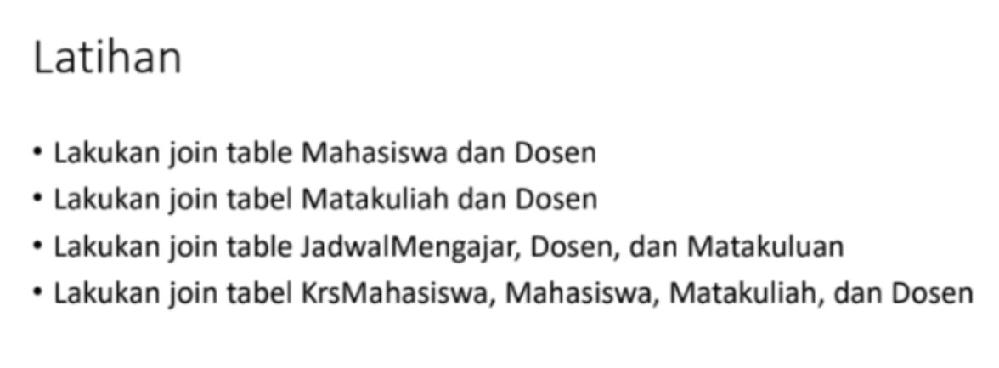

# databasepraktikum5

# praktikum5_database

# Praktikum5_SQL

```
Nama    : Dimas adi nugraha
NIM     : 312210409
Kelas   : TI.22.A.4
```

## SQL JOIN

SQL JOIN adalah operasi yang digunakan untuk menggabungkan baris dari dua atau lebih tabel berdasarkan kondisi yang ditentukan. Dengan menggunakan JOIN, Anda dapat mengambil data yang terkait dari tabel yang berbeda dalam satu query. ada beberapa jenis JOIN dalam SQL, termasuk:

    1. INNER JOIN: Menggambungkan baris dari dua tabel berdasarkan kesamaan nilai kolom yang dijadikan kondisi JOIN. Hanya baris yang memiliki kesamaan nilai dalam kedua tabel yang akan dihasilkan.
    2. LEFT JOIN ( atau LEFT OUTER JOIN): Menggambungkan baris dari dua tabel berdasarkan kesamaan nilai dalam kolom yang dijadikan kondisi JOIN. Selain itu, semua beris dari tabel yang di-left join akan tetap ditampilkan, bahkan jika tidak ada kesamaan nilai dalam tabel kanan.
    3. RIGHT JOIN (atau RIGHT OUTER JOIN): Mirip dengan LEFT JOIN, tetapi semua baris dari tabel yang di-right join akan tetap ditampilkan, bahkan jika tidak ada kesamaan nilai dalam tabel kiri.
    4. FULL JOIN (atau FULL OUTER JOIN): Menggabungkan baris dari dua tabel dengan mempertahankan semua baris dari kedua tabel, bahkan jika tidak ada kesamaan nilai. Jika tidak ada kesamaan nilai, kolom untuk tabel yang tidak memiliki nilai akan berisi NULL.
    5. CROSS JOIN: Menghasilkan hasil gabungan dari kedua tabel tanpa memerikaa kondisi. Jumlah baris yang dihasilkan akan menjadi perkalian dari jumlah baris pada kedua tabel.

# Latihan Praktikum 5



1. JOIN Table Mahasiswa dan dosen

   ```sql
   SELECT Mahasiswa.nim, Mahasiswa.nama, Mahasiswa.jk, Dosen.nama AS "Dosen PA"
   FROM Mahasiswa INNER JOIN Dosen ON Dosen.kd_ds = Mahasiswa.kd_ds;
   ```

2. LEFT JOIN Table Mahasiswa dan dosen

   ```sql
   SELECT Mahasiswa.nim, Mahasiswa.nama, Mahasiswa.jk, Dosen.nama AS "Dosen PA"
   FROM Mahasiswa LEFT JOIN Dosen ON Dosen.kd_ds = Mahasiswa.kd_ds;
   ```

3. JOIN Table Matakuliah dan Dosen

   ```sql
   SELECT Matakuliah.kd_mk, Matakuliah.nama, Matakuliah.sks, Dosen.nama AS "Dosen Pengampu"
   FROM JadwalMengajar
   LEFT JOIN Matakuliah ON JadwalMengajar.kd_mk = Matakuliah.kd_mk
   LEFT JOIN Dosen ON JadwalMengajar.kd_ds = Dosen.kd_ds;
   ```

4. JOIN Table JadwalMengajar, Dosen, dan MataKuliah

   ```sql
   SELECT Matakuliah.kd_mk, Matakuliah.nama, Matakuliah.sks, Dosen.nama AS "Dosen Pengampu", JadwalMengajar.hari, JadwalMengajar.jam, JadwalMengajar.ruang
   FROM JadwalMengajar
   LEFT JOIN Matakuliah ON JadwalMengajar.kd_mk = Matakuliah.kd_mk
   LEFT JOIN Dosen ON JadwalMengajar.kd_ds = Dosen.kd_ds;
   ```

5. JOIN Table KRSMahasiswa, Mahasiswa, MataKuliah, dan Dosen

   ```sql
   SELECT Mahasiswa.nim, Mahasiswa.nama AS "nama", Dosen.nama AS "Dosen PA", Matakuliah.nama AS "Matakuliah", Matakuliah.sks, Dosen.nama AS "Dosen Pengampu"
   FROM KRSMahasiswa
   JOIN Mahasiswa ON KRSMahasiswa.nim = Mahasiswa.nim
   JOIN Matakuliah ON KRSMahasiswa.kd_mk = Matakuliah.kd_mk
   JOIN Dosen ON KRSMahasiswa.kd_ds = Dosen.kd_ds;
   ```